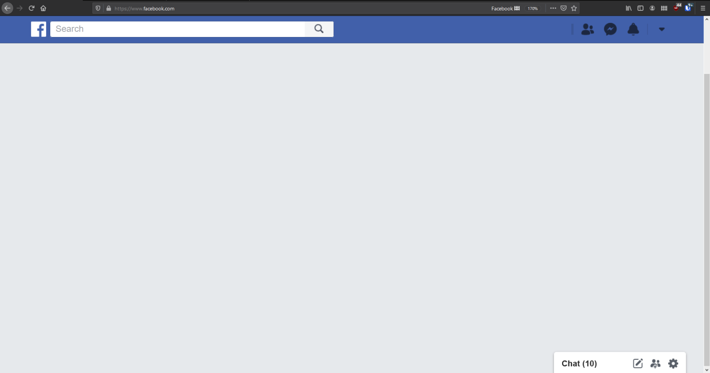
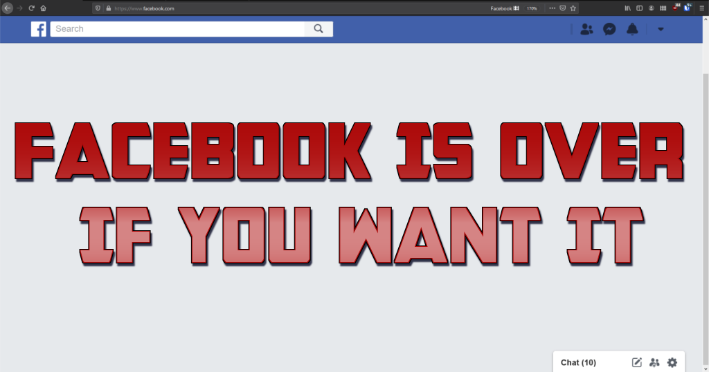

# ublock-origin-facebook-filter
Blocks elements from the Facebook web app, removing any main page feed or the ability to post on your own profile. The intention is to give you access to the informational resource Facebook can be while removing as many things about it that suck you up into the world of maintaining a Facebook account or a social life of spamming propaganda and memes at people.

Use Facebook to search someone and see what they are doing when you need it. But when you're done, leave. 

## Installation
Get [uBlock Origin](https://ublockorigin.com/) extention for your browser.

In the settings, under the "My Filters" tab, click the "Import and Append" button

Select `ublock-origin-facebook-filter.txt` and submit. 

## Facebook is over
#### ...if you want it.

Feel free to submit a pull request.
